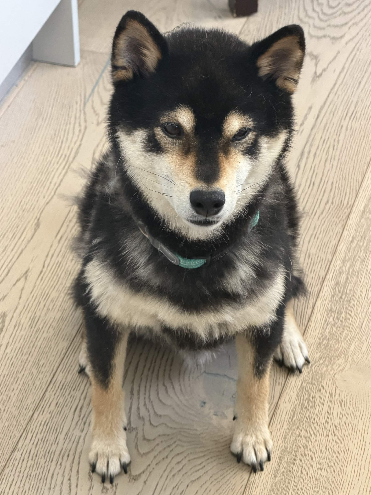

Ellen Yu is an Engineering student at [Harvey Mudd College](https://hmc.edu). She is interested in hardware design. In her free time, she likes to draw and work on her world building project.

No one asked for this but this is a picture of my dog he is shedding right now
