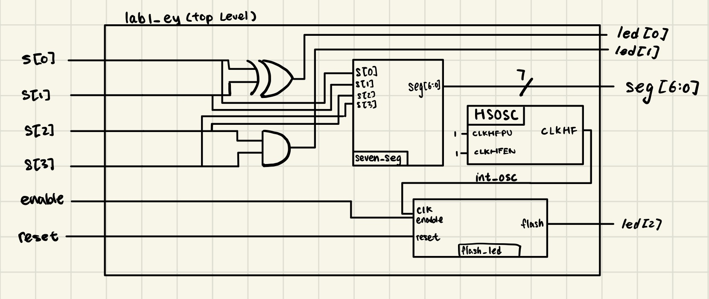
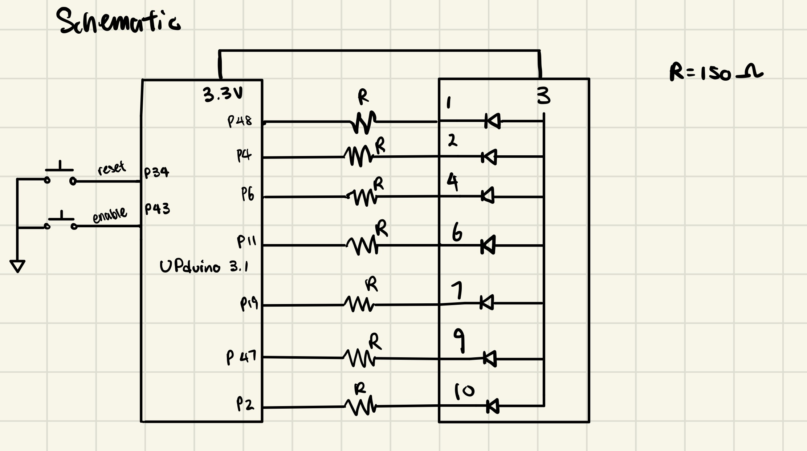
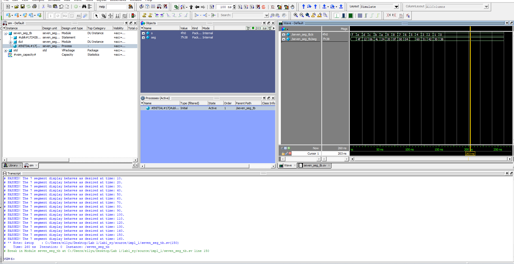
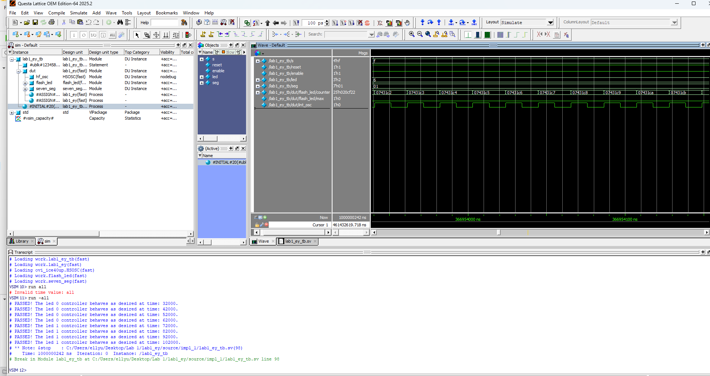
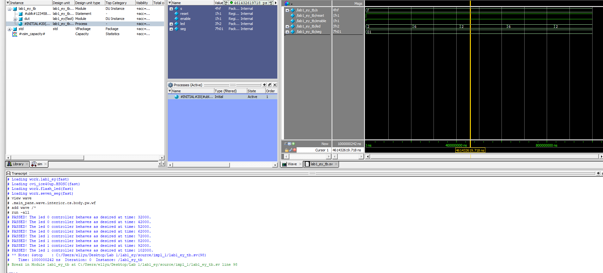
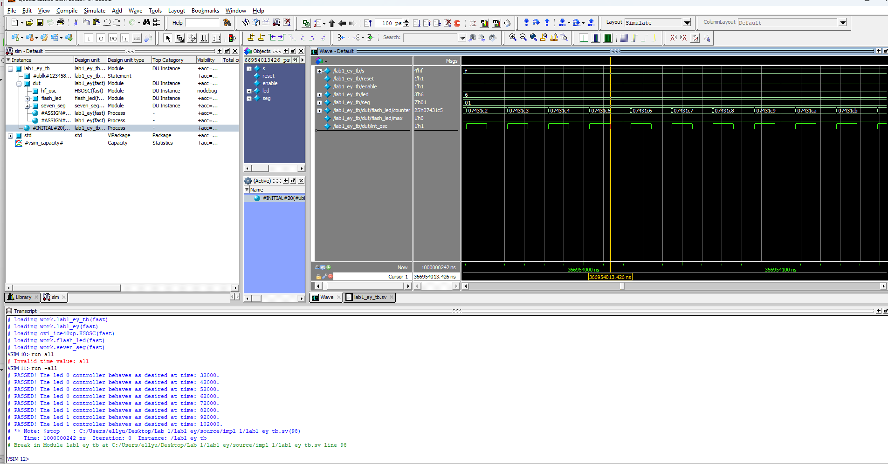
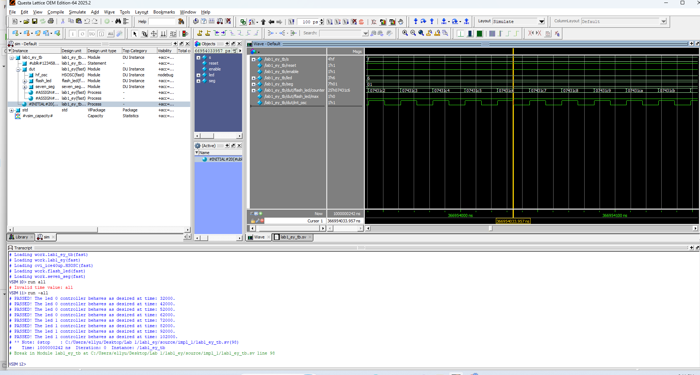

---
title: "Lab 1 - Board Assembly and Testing"
description: "Hardest thing turns out to be computer not connecting to hardware..."
author: "Ellen Yu"
date: "9/1/26"
categories:
  - reflection
  - labreport
draft: false
--- 
## Introduction
The design for this lab has the following features:

+ 4 switch inputs that control 2 LEDs and a 7 segment display

+ An LED that blinks at 2.4 Hz, controlled by HSOSC (onboard high-speed oscillator) that has a frequency of 48 MHz.

The four switches are viewed as 4 bits and the seven segment display shows the hexadecimal representation of the 4 bits. 

## Design and Testing Methodology

The HSOSC at a frequency of 48 MHz is used to generate the clock input into the flash_led module. The flash_led module contains a counter that converts the 48 MHz signal into a signal that blinks at 2.4 Hz. The calculation for the counter maximum threshold is shown as below:

In order for the LED to blink at 2.4 Hz. The signal sent to the LED need to be switching at a frequency of 4.8 Hz between 0 and 1. In order to produce the 4.8 Hz signal, calculate $48 MHz / 4.8 Hz$ to figure out the maximum threshold of the counter needs to be $10^7$. Then, set flash (the signal sent to the LED) to be equal to the opposite value that flash previously hold to blink the LED. 

For the other LEDs and the seven-segment display, combinational logic is used to map switch inputs to outputs.

## Technical Documentation

The source code for the project can be found in the associated [Github repository](https://github.com/Teemooooooooo/e155-lab1).

### Block Diagram

::: {.callout-note collapse="true"}
## Block Diagram
{#fig-block}
::: 

The block diagram in @fig-block shows the overall architecture of the design. The lab1_ey module is the top level module. It contains the switch to LED logic and three submodules: the high-speed oscillator block (HSOSC), flash LED module (flash_led), and the seven_segment display module (seven_seg).

### Schematic

::: {.callout-note collapse="true"}
## Schematic of the seven-segment display
{#fig-schematic}
::: 

The schematic in @fig-schematic shows the physical layout of the UPduino to the seven-segment display connection. The LED on each segment is connected to the output pin of UPduino using a 150 ohm current-limiting resistor (R) to ensure the output current does not burn the LED. 

The resistor value calculation is shown below:

$I_D = (V_{DD} - V_{on})/(R_s + R_D)$

Assume $R_s$ to be negligible, and from reading the datasheet, we get that 

$V_{dd} = 3.3 V$

$V_{forward} = 2.1 V$ for the LEDs, which is the $V_{on}$ in the calculation.

$I_D$ is between 5 to 20 mA.  

$I_D = 8 mA$ is chosen for this calculation. Plug in the numbers stated above, we get that $R_D = 150 ohm$

## Result and Discussion

### Testbench Simulation

There is one testbench for each module to verify that the design met all intended objectives. 

::: {.callout-note collapse="true"}
## counter waveform
{#fig-sim_counter_tests}

{#fig-sim_counter_reset}

{#fig-sim_counter}
:::

::: {.callout-note collapse="true"}
## Some tests from testbench code

```
   // testing enable behavior (on)
        enable = 1'b1;
        reset = 1'b0;
        #10;
        reset = 1'b1;
        #50;
        assert (dut.counter == 24'b101)
            $display("PASSED! Counter did not increment at time: %0t.", $time);
        else 
            $error("FAILED! Counter behaves incorrectly at time: %0t.", $time); 
        
        assert (flash == 'b0)
            $display("PASSED! LED is off as expected: %0t.", $time);
        else 
            $error("FAILED! LED behaves incorrectly at time: %0t.", $time); 

    // testing max counter behavior (LED on)
        reset = 1'b0;
        #10;
        reset = 1'b1;
        #100000000; // counter reach MAX_threshold
		assert (dut.counter == 24'b0)
            $display("PASSED! Counter got back to zero as expected: %0t.", $time);
        else
            $display("FAILED! Counter has %0d at time: %0t.", dut.counter, $time);
		
        assert (flash == 1'b1)
            $display("PASSED! LED turned on as expected: %0t.", $time);
        else
            $display("FAILED! LED has incorrect behavior at time: %0t.", $time);
    
    // then wait another max LED should turn off
        #100000000;
		#10;
        assert (flash == 1'b0)
            $display("PASSED! LED turned off as expected at counter %0d: %0t.", dut.counter, $time);
        else
            $display("FAILED! LED has incorrect behavior at time: %0t.", $time);
```
:::

The waveform simulation and test results of the flash LED module (flash_led) is shown in @fig-sim_counter_tests, @fig-sim_counter and @fig-sim_counter_reset. This testbench cover the reset behavior, enable behavior, and the behavior at counter maximum threshold. The DUT exhibit expected behavior for all test cases. 

::: {.callout-note collapse="true"}
## seven-segment waveform
{#fig-seven}

:::

The waveform simulation and the test results of the seven segment display module (seven_seg) is shown in @fig-seven. As shown, the testbench covers all 16 possible input combinations and their expected outputs and the DUT passes all test cases. 

::: {.callout-note collapse="true"}
## Top level waveform
{#fig-top_all}


{#fig-top}
::: 

The top level testbench is shown in @fig-top_all and @fig-top. This testbench tests all cases of the switch to LED logic and the DUT does pass all test cases. This testbench also verifies that the connections to submodules are working properly as the flashing LED does exhibit expected behavior. 

::: {.callout-note collapse="true"}
## HSOSC timing
{#fig-time1}

{#fig-time2}

::: 

The testbench also shows the HSOSC working in the waveform. The frequency can be calculated as $1/ period = 1/(20 ns) = 50 MHz$. This is close to the expected value of 48 MHz. 

## Conclusion

The design successfully blinked an on-board LED using the HSOSC and the switch inputs does correctly control the two LEDs and the seven-segment display. 

I spent 30 hours on this lab.

## AI Prototype summary

::: {.callout-note collapse="true"}
## Code produced by AI
```
// Top module name must match your project configuration: led_blink
module led_blink (
    output logic led
);

    logic clk_48m;

    // Lattice Radiant Primitive for the High Speed Oscillator
    HSOSC #(
        .CLKHF_DIV("0b00")  // "0b00" = 48 MHz, "0b01" = 24 MHz, "0b10" = 12 MHz, "0b11" = 6 MHz
    ) hfosc_inst (
        .CLKHFPU(1'b1),    // Power up oscillator
        .CLKHFEN(1'b1),    // Enable clock output
        .CLKHF  (clk_48m)  // Output clock signal
    );

    // 48,000,000 Hz / (2 * 2 Hz) = 12,000,000 cycles per toggle
    localparam int TOGGLE_LIMIT = 12_000_000;
   
    logic [$clog2(TOGGLE_LIMIT)-1:0] counter = '0;

    always_ff @(posedge clk_48m) begin
        if (counter == TOGGLE_LIMIT - 1) begin
            counter <= '0;
            led     <= ~led;
        end else begin
            counter <= counter + 1'b1;
        end
    end

endmodule
```
::: 
I used Gemini to produce this code. I would say that the quality of the code is very luck dependent. When I tried to do it with AI for the first time, it did not synthesize properly even when I fed the error message back into the LLM for 5 times. After I started a new chat, it made synthesizable code within 2 tries. The '0 part of the code that AI generated is new to me. The code did not synthesize for the first time because it had issue with the HFOSC naming that is specific to the Lattice Radiant software. Radiant outputs "ERROR <35901063> - ../source/impl_1/led_blink.sv(18): instantiating unknown module SB_HFOSC. VERI-1063". I would let the LLM know what software I am working with first if I use LLM in my workflow. 


