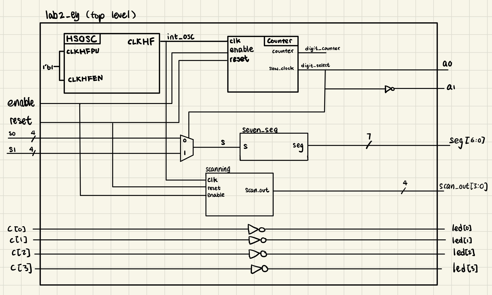
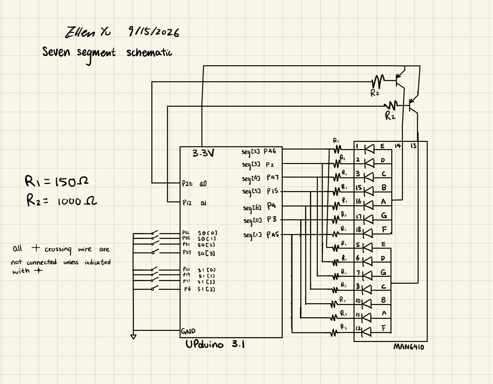
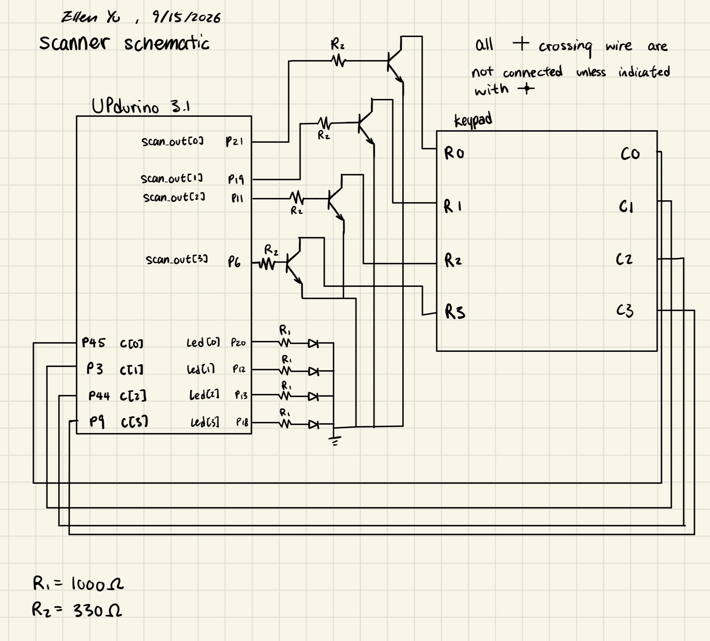
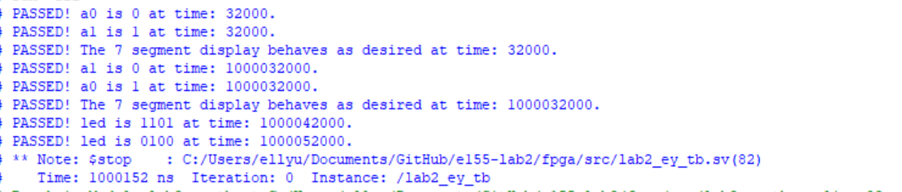
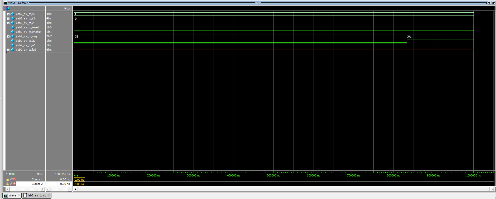
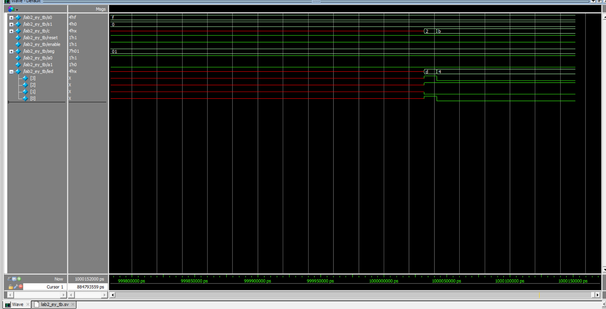
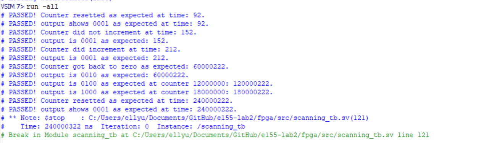
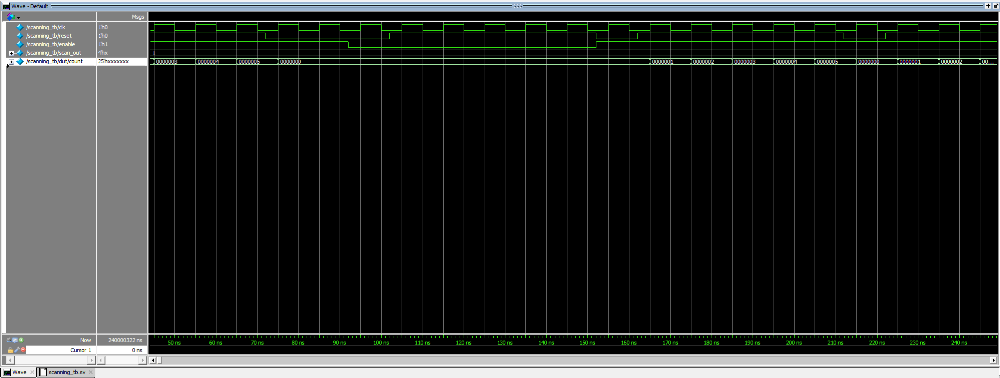
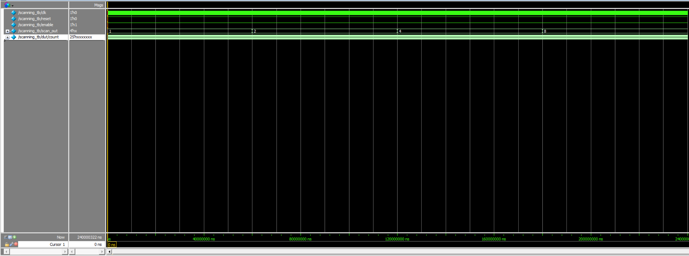
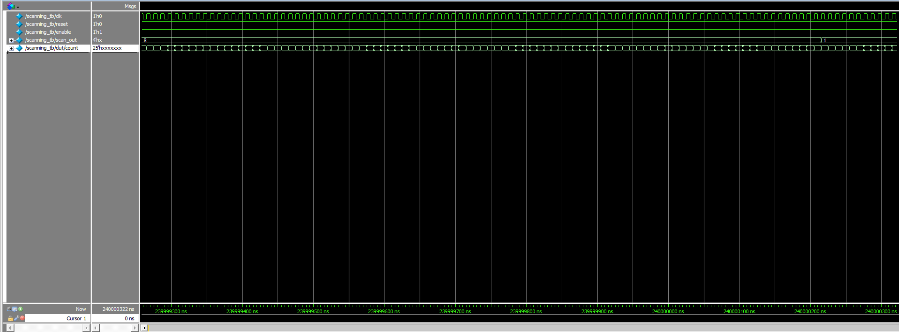

---
title: "Lab 2 - Multiplexed 7-Segment Display"
description: "First thing when debugging -- ALWAYS CHECK POWER"
author: "Ellen Yu"
date: "9/15/26"
categories:
  - reflection
  - labreport
draft: false
--- 
## Introduction
The design for this lab has the following features:

+ 8 switch inputs that control two 7-segment displays, established through a time-multiplexing scheme

+ A scanning module that detects the input from keypad, reflecting the input on four LEDs 

The four switches are viewed as 4 bits and the seven segment display shows the hexadecimal representation of the 4 bits. 

## Design and Testing Methodology

The HSOSC at a frequency of 48 MHz is used to generate the clock input into the multiplex counter and the scanning module. From researching, it was learned that the threshold frequency at which human will not be able to detect blinking is 60 Hz. Therefore, the multiplex counter is used to reduce the 48 MHz clock down to a 60 Hz slower clock.

## Technical Documentation

The source code for the project can be found in the associated [Github repository](https://github.com/Teemooooooooo/e155-lab2).

### Block Diagram

::: {.callout-note collapse="true"}
## Block Diagram
{#fig-block}
::: 
The block diagram in @fig-block shows the overall architecture of the design. The lab2_ey module is the top level module. It contains four submodules: the high-speed oscillator block (HSOSC), seven-segment display module (seven_seg), multiplexing counter (counter), and the scanning module (scanning). It also have simple combinational logic to implement multiplexing and scanning passthrough.

### Schematic

::: {.callout-note collapse="true"}
## Schematic of the seven-segment display
{#fig-schematic_seven}
::: 

The schematic in @fig-schematic_seven shows the physical layout of the UPduino to the seven-segment display connection. Each LED segment is connected to the output pin of UPduino using a 150-ohm current-limiting resistor (R) to ensure the output current does not burn the LED. 

The resistor value calculation is shown below:

For the resistors connected to LEDs ($R_1$):

$I_D = (V_{DD} - V_{on} - V_{transistor})/(R_s + R_1)$

Assume $R_s$ to be negligible, and from reading the datasheet, we get that 

$V_{dd} = 3.3 V$, $V_{transistor} = 0.25 V$ (Collector−Emitter Saturation Voltage). 

$V_{forward} = 2.1 V$ for the LEDs, which is the $V_{on}$ in the calculation.

$I_D$ is between 5 and 20 mA.  

$I_D = 8 mA$ is chosen for this calculation. Plug in the numbers stated above, we get that the minimum value of $R_1 = 118.75 ohm$. The implementation uses 150 ohm resistors as they satisfy the requirement and are avaliable in the stockroom.

For the resistors connected to the GPIO pins ($R_2$): 

$I_D = (V_{DD} - V_{drop_transistor})/(R_s + R_2)$

The voltage drop across the PNP transistor is 0.7 V. The current going to the pin needs to be within 9 mA. Assume $R_s$ to be negligible and plug in numbers above, we get 
$R_2 = 325 ohm$
as the minimum resistance needed for the voltage limiting resistors. The implementation choses 1000 ohm resistance. 


::: {.callout-note collapse="true"}
## Schematic of the keypad
{#fig-schematic_key}
::: 

The schematic in @fig-schematic_key shows the physical layout of the UPduino to the keypad. Note that some pins are repeatedly used from above as this part of hardware uses a different set of pin assginment. 

The resistor value calculations are shown below:

For the current-limiting resistors for LEDs ($R_1$):

$I_D = (V_{DD} - V_{on})/(R_s + R_1)$

Assume $R_s$ to be negligible, and $V_{dd} = 3.3 V$

$V_{forward} = 2.1 V$ for the LEDs, which is the $V_{on}$ in the calculation.

$I_D$ is between 5 and 20 mA.  

$I_D = 8 mA$ is chosen for this calculation. Plug in the numbers stated above, we get that minimum resistance needed is $R_1 = 150 ohm$. The resistance value used for $R_1$ in this implementation is 1000 ohm. 

For the resistors connecting the NPN transistors to the GPIO pins ($R_2$), the calculation is same as the calculation for PNP transistors above where the minimum required resistance is $R_2 = 325 ohm$. This implementation uses $R_2 = 330 ohm$. 

## Result and Discussion

### Testbench Simulation

There are a total of 2 testbenches written, testing functionality of the top-level module and the scanning module. The counter and seven-segment display module were already tested from lab 1. 

::: {.callout-note collapse="true"}
## top level waveform
{#fig-top_test}

{#fig-top_multiplex}

{#fig-top_led}
:::

The waveform simulation and test results of the top-level module are shown in @fig-top_led, @fig-top_multiplex and @fig-top_test. This testbench covers the multiplex and LED driving functionality. The DUT exhibits expected behavior for all test cases. 

::: {.callout-note collapse="true"}
## scanning module waveform
{#fig-scan_test}

{#fig-scan_reset_enable}

{#fig-scan_state_1}


{#fig-scan_state_2}
:::

The waveform simulation and test results of the top-level module are shown in @fig-scan_test, @fig-scan_reset_enable, @fig-scan_state_1 and @fig-scan_state_2. This testbench covers the multiplex and LED driving functionality. The DUT exhibits expected behavior for all test cases. 

## Conclusion

The design successfully implemented time-multiplex scheme on two seven-segment displays and drived external LEDs based on keypad input. 

I spent 20 hours on this lab.

## AI Prototype summary

I used Gemini to produce the code. I attempted the AI prototype and the quality is good. I tried to synthesize it and it worked on the first try. There is not any syntax in AI code that is not familiar to me. The prompting did not make a big difference as the AI already uses the provided file even when not explicitly asked to. I will consider whether AI will use the files I provided in the next time that I use LLM.  


::: {.callout-note collapse="true"}
## Code example produced by AI using prompt 1
```
module time_mux_seven_seg #(
    parameter COUNTER_SIZE = 25,
    parameter MAX_THRESHOLD = 24'd10000000
)(
    input  logic       clk,
    input  logic       reset,
    input  logic       enable,
    input  logic [3:0] in0,
    input  logic [3:0] in1,
    output logic [6:0] seg0,
    output logic [6:0] seg1
);

    logic       select_display;
    logic [3:0] mux_in;
    logic [6:0] decoded_seg;

    // Clock divider instantiation
    counter #(
        .COUNTER_SIZE(COUNTER_SIZE),
        .MAX_THRESHOLD(MAX_THRESHOLD)
    ) clk_div (
        .clk(clk),
        .reset(reset),
        .enable(enable),
        .slow_clk(select_display),
        .counter
    );

    // Mux input selection
    assign mux_in = select_display ? in1 : in0;

    // Single shared decoder
    seven_seg decoder (
        .s(mux_in),
        .seg(decoded_seg)
    );

    // Latch outputs for each display
    always_ff @(posedge clk) begin
        if (~reset) begin
            seg0 <= 7'b1111111;
            seg1 <= 7'b1111111;
        end else begin
            if (~select_display)
                seg0 <= decoded_seg;
            else
                seg1 <= decoded_seg;
        end
    end

endmodule
```
::: 