---
title: "Lab 3 - Keypad Scanner"
description: "Display the value of the pressed key on the seven segment display!"
author: "Ellen Yu"
date: "9/22/26"
categories:
  - reflection
  - labreport
draft: false
--- 
## Introduction
The design for this lab has the following features:

+ A dual seven-segment display that shows the last two hexadecimal digit pressed on the keypad, with the most recent entry appearing at the right

+ A keypad that takes user input with each press recorded exactly once

+ The display value should not update if additional keys are pressed while still holding down the first key

## Design and Testing Methodology

The HSOSC at a frequency of 48 MHz is used to generate the clock input into the multiplex counter and the scanning module. From researching, it was learned that the threshold frequency at which human will not be able to detect blinking is 60 Hz. Therefore, the multiplex counter is used to reduce the 48 MHz clock down to a 60 Hz slower clock.

A synchronizer is used to handle asynchronous column reading, and the same synchronizer is applied to the already synchronous row readings to ensure the column and row values match when mapping the readings to the key values.

::: {.callout-note collapse="true"}
## Main FSM
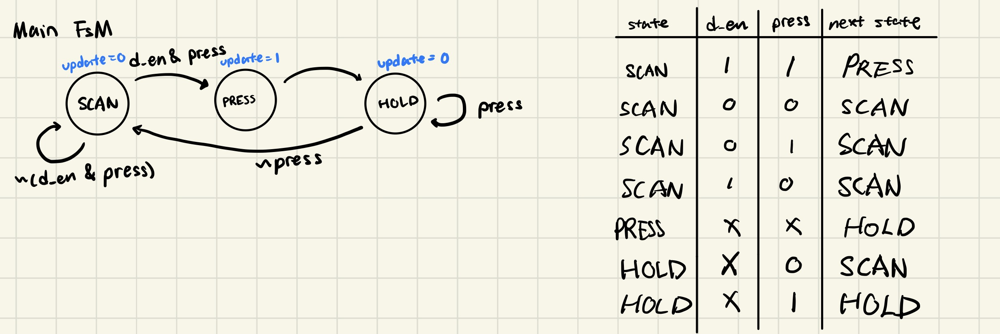{#fig-main_fsm}
::: 

::: {.callout-note collapse="true"}
## Debounce FSM
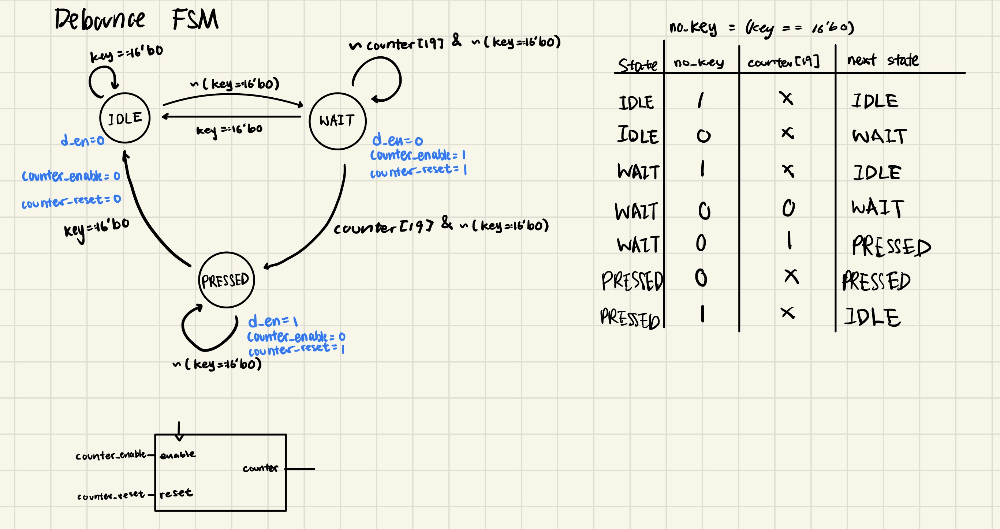{#fig-debounce_fsm}
:::

The design includes various finite state machines that communicate with each other. Two of the main canonical FSMs implemented are the main FSM that controls the update logic of the seven-segment display and the debounce FSM that handles switch bouncing. The state transition diagram and the next state logic of the two FSMs are shown in @fig-main_fsm and @fig-debounce_fsm.

The debounce module outputs the ```d_en``` signal that indicates at least one key is actually being pressed and the switch is no longer bouncing. This signal allows the main FSM to transition to the PRESSED stage. In the PRESSED state, the main FSM send a ```update``` signal to the seven-segment display input selection module(sev_seg_input) to update the input into the seven segment display. This design divides up the signals cleanly and only requires FSMs with at most 3 states. Other designs may involve fewer finite state machines with more states, which can cause the state transition conditions to be more complicated.

The debounce module handles switch debouncing by blocking the main FSM from updating the display.The main FSM will only update the display if the debounce module set ```d_en``` signal to high. Debounce module sets ```d_en``` only when the input switch has been pressed for long enough. This debounce module handles switch debounce at the cost of filtering out super short clicks. Physically, any press would last for a time that is way longer than the switch bouncing period, therefore this design does work successfully.

## Technical Documentation

The source code for the project can be found in the associated [Github repository](https://github.com/Teemooooooooo/e155-lab3).


### Block Diagram

::: {.callout-note collapse="true"}
## Top Leve Block Diagram
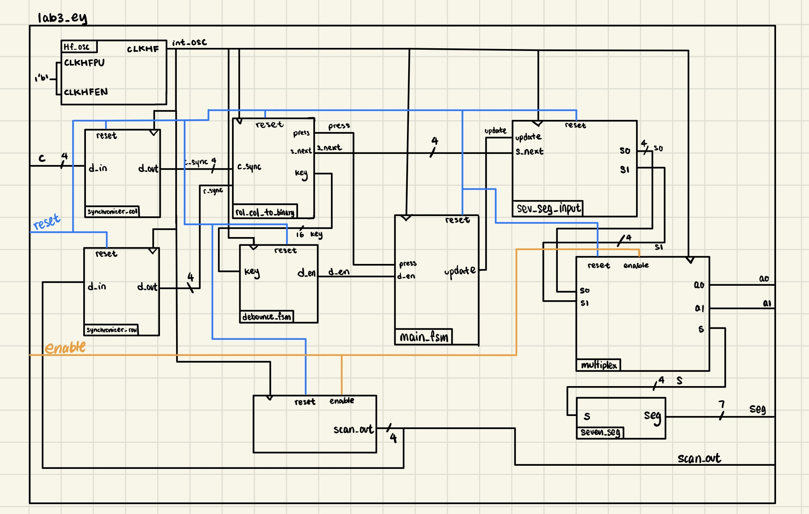{#fig-top_block}
::: 
The block diagram in @fig-top_block shows the overall architecture of the design. The lab3_ey module is the top level module. 

::: {.callout-note collapse="true"}
## Block Diagram of Synchronizer
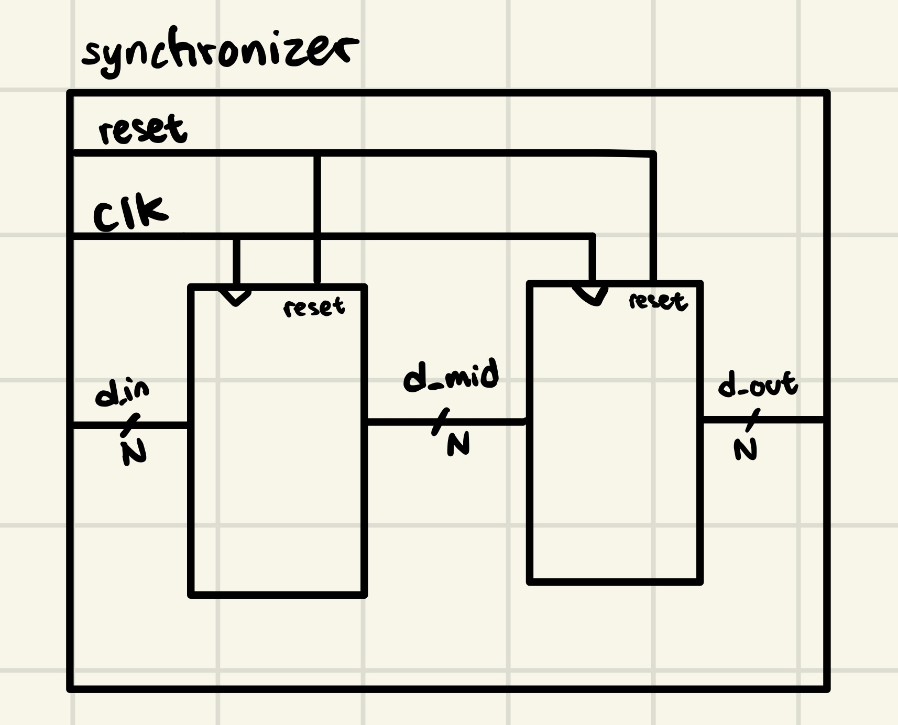{#fig-synchronizer_block}
:::

The block diagram of the synchronizer module is shown in @fig-synchronizer_block.


::: {.callout-note collapse="true"}
## Block Diagram of Reading to Key Encoding Module
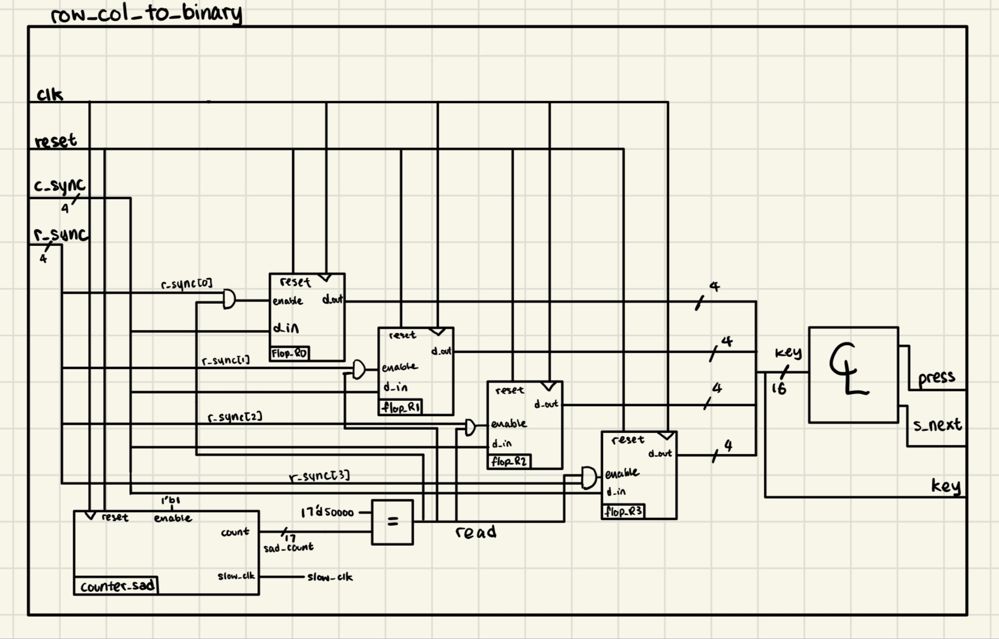{#fig-row_col_to_binary_block}
:::

The block diagram of the module that converts row and column reading into 16-bit one-hot encoding and binary value (row_col_to_binary) is shown in @fig-row_col_to_binary_block.


### Schematic

::: {.callout-note collapse="true"}
## Schematic of the Desgin
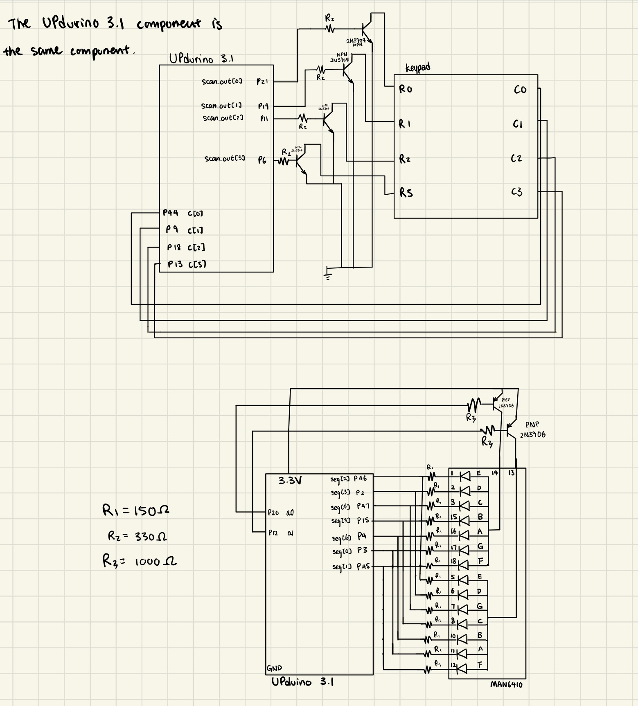{#fig-schematic}
::: 

The schematic in @fig-schematic shows the physical layout of the UPduino to the seven-segment display and keypad connection. The calculation of the resistor values can be found in [lab 2 report](https://teemooooooooo.github.io/MicroPs-Portfolio/labs/lab2/lab2.html#schematic).

## Result and Discussion

### Testbench Simulation

There are a total of 6 testbenches written, testing functionality of the top-level module and the new modules. The modules that were already tested from previous labs are not retested. 

::: {.callout-note collapse="true"}
## top level waveform
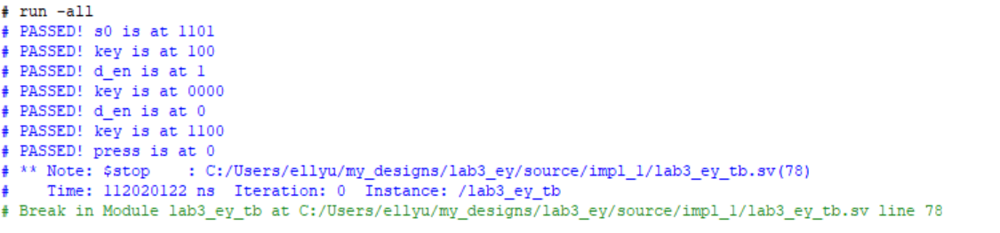{#fig-top_test}

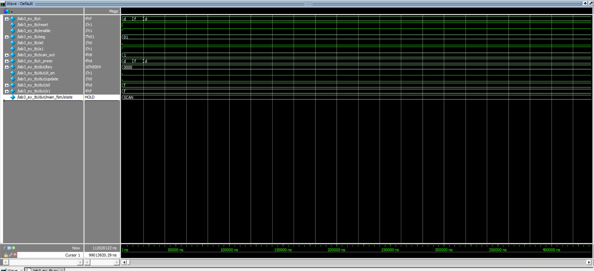{#fig-top_wave1}


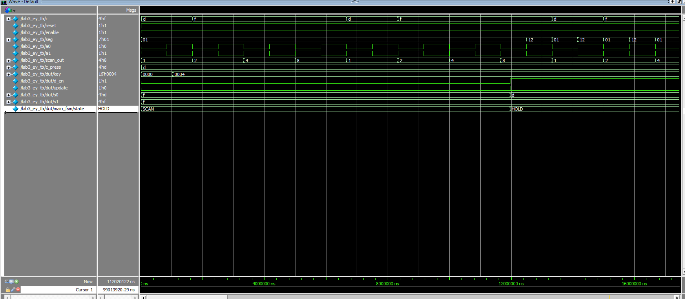{#fig-top_wave2}


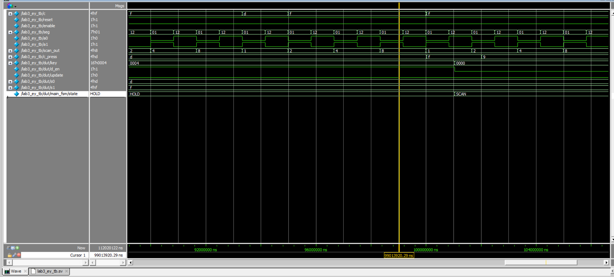{#fig-top_wave3}
:::

The waveform simulation and test results of the top-level module are shown in @fig-top_wave1, @fig-top_wave2, @fig-top_wave3 and @fig-top_test. This testbench includes a simulated key press with switch bouncing. The DUT exhibits expected behavior for all test cases. 


::: {.callout-note collapse="true"}
## Debounce module waveform
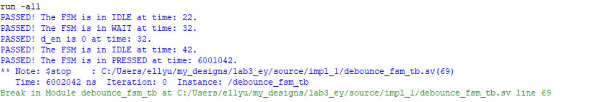{#fig-debounce_test}

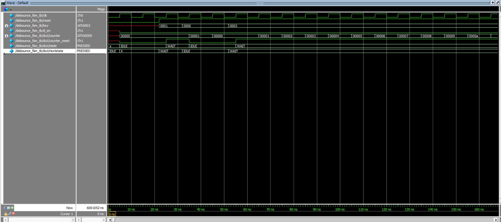{#fig-debounce_wave1}


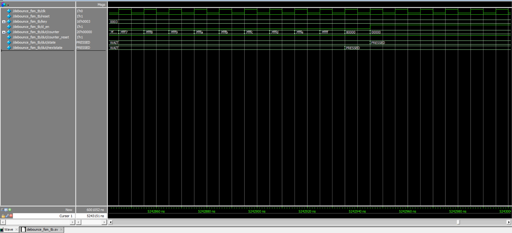{#fig-debounce_wave2}


:::

The waveform simulation and test results of the debounce module are shown in @fig-debounce_wave1, @fig-debounce_wave2 and @fig-debounce_test. The DUT exhibits expected behavior for all test cases. 


::: {.callout-note collapse="true"}
## Main FSM module waveform
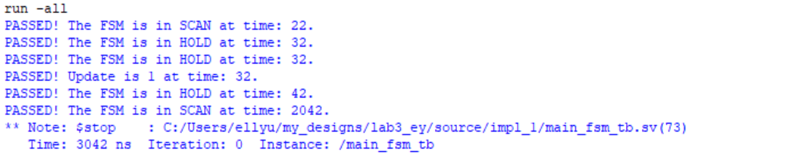{#fig-main_fsm_test}

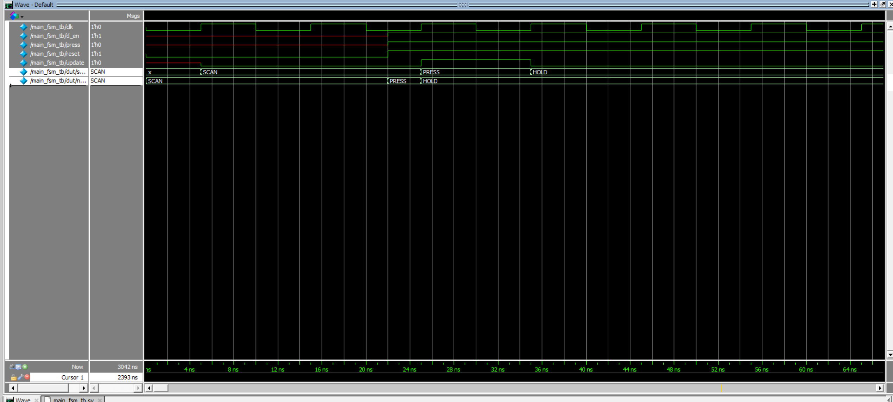{#fig-main_fsm_wave1}


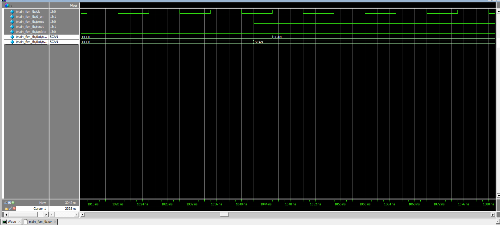{#fig-main_fsm_wave2}


:::

The waveform simulation and test results of the main FSM module are shown in @fig-main_fsm_wave1, @fig-main_fsm_wave2 and @fig-main_fsm_test. The DUT exhibits expected behavior for all test cases. 


::: {.callout-note collapse="true"}
## Reading to encoding module waveform
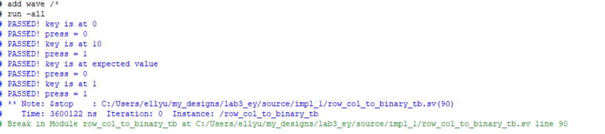{#fig-row_col_to_binary_test}

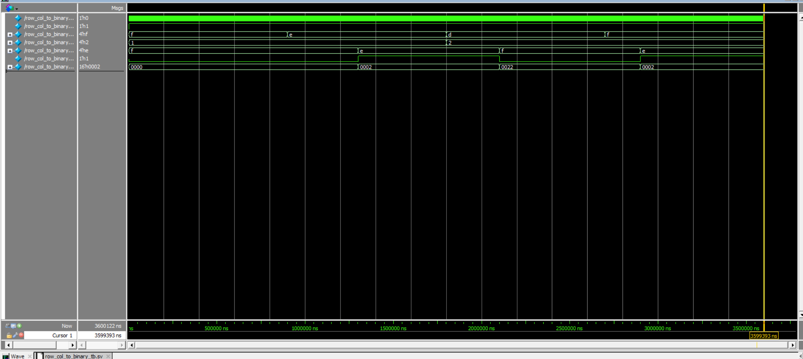{#fig-row_col_to_binary_wave}

:::

The waveform simulation and test results of the reading to encoding module (row_col_to_binary) are shown in @fig-row_col_to_binary_wave and @fig-row_col_to_binary_test. The DUT exhibits expected behavior for all test cases. 


::: {.callout-note collapse="true"}
## Seven-segment display input selection module waveform
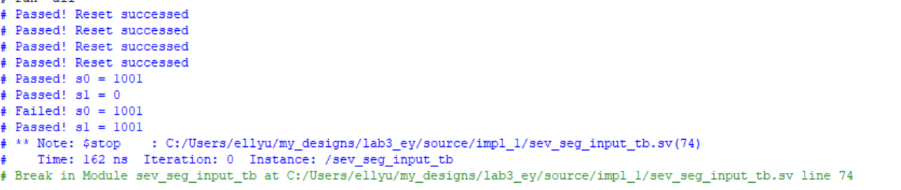{#fig-sev_seg_input_test}

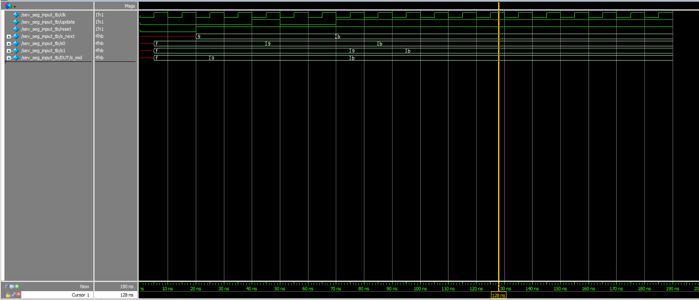{#fig-sev_seg_input_wave}

:::

The waveform simulation and test results of the seven-segment display input selection module are shown in @fig-sev_seg_input_wave and @fig-sev_seg_input_test. The DUT exhibits expected behavior for all test cases. 


::: {.callout-note collapse="true"}
## Synchronizer module waveform
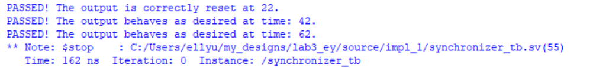{#fig-synchronizer_test}

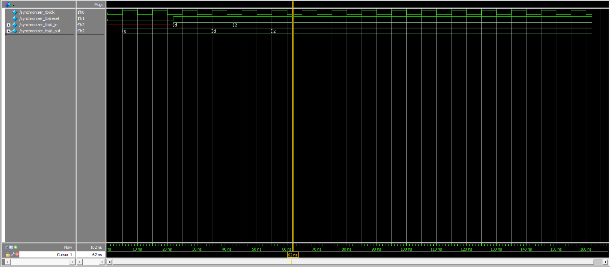{#fig-synchronizer_wave}

:::

The waveform simulation and test results of the synchronizer module are shown in @fig-synchronizer_wave and @fig-synchronizer_test. The DUT exhibits expected behavior for all test cases. 

::: {.callout-note collapse="true"}
## Debounce module waveform
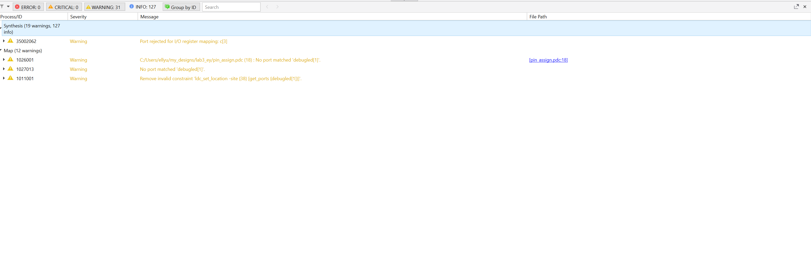{#fig-synth}

:::

Synthesizer output in @fig-synth showing that design has no latches and no tristate buffers.


## Conclusion

The design successfully drived a time-multiplexed seven-segment display based on keypad input. 

I spent 38 hours on this lab.

## AI Prototype summary

I used Gemini to produce the code. I attempted the AI prototype and the quality is not great. The code that was first produced had some typos in it so the synthesize fails. I then fed back the error message into the LLM for around 5 more times and the LLM is still not able to fix it. This was the case for both prompts. 

The LLM was also using functions in the produced code. I am not familiar with the use of this syntax therefore it was hard for me to understand the produced code.