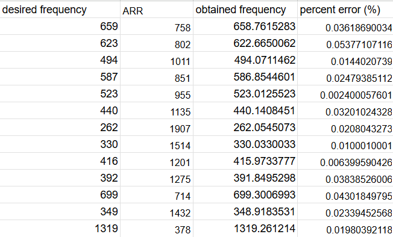
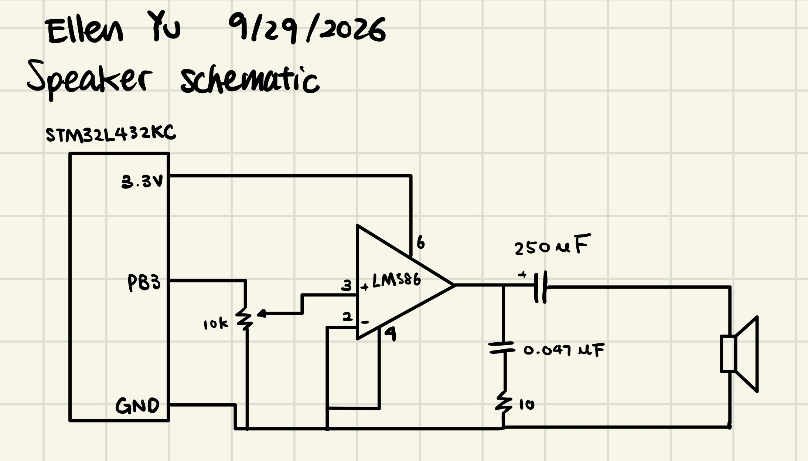
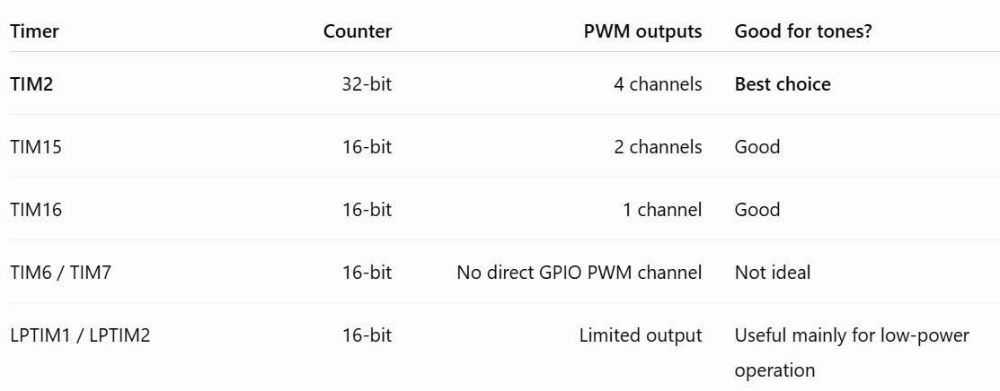

---
title: "Lab 4 - Digital Audio"
description: "Using C code to play music!"
author: "Ellen Yu"
date: "9/30/26"
categories:
  - reflection
  - labreport
draft: false
--- 
## Introduction
The design for this lab uses the clock on an MCU to play Für Elise.

## Design and Testing Methodology
This design uses the timer 15 and timer 16 to control the pitch and duration of each note. Timer 15 controls duration and timer 16 controls note pitch.

Both timers uses a 80M Hz clock, which is brought up by PPL from a 4M Hz clock. The conversion from note frequency to timer 16 configurations are shown as follows:

$note frequency * 2 = \frac {clk frequency}{(ARR + 1)(PSC + 1)}$

The implementation toggles the output at twice the note frequency to produce a square wave at the desired frequency. This implementation chooses PSC to be 79 for timer 16. Since ARR is 16 bits, the highest number it can represent is $2^{16}-1$. Therefore, the highest frequency that this implementation supports is: 

$\frac {80000000}{(1)(80)(2)}$ = 500000 Hz

The lowest note frequency that this implmentation supports is:

$\frac {80000000}{(2^{16})(80)(2)}$ = 8 Hz

::: {.callout-note collapse="true"}
## All notes frequencies in Für Elise with percent error
{#fig-accuracy}
::: 

As shown in @fig-accuracy, the implementation is capable of replicating all notes in Für Elise within 1% accuracy.

The conversion from note duration to timer 15 configurations are shown as follows:

$duration = \frac {(ARR)(PSC+1)}{(80000000)}$

In code implementation divides by 80000 instead as the reference durations are provided in milliseconds. This design chooses PSC to be 7999 for timer 15. Since ARR is 16 bits, the highest number it can represent is $2^{16}-1$.

The maximum duration supported by this design is:

$duration = \frac {(2^{16}-1)(7999+1)}{(80000)}$ = 6553.5 millisecond

The maximum duration supported by this design is:

$duration = \frac {(0)(7999+1)}{(80000)}$ = 0 millisecond

## Technical Documentation

The source code for the project can be found in the associated [Github repository](https://github.com/Teemooooooooo/e155-lab4).

### Schematic

::: {.callout-note collapse="true"}
## Schematic of the Design
{#fig-schematic}
::: 

The schematic in @fig-schematic shows the physical layout of the MCU to speaker connection. The circuit design is based on the information found on the datasheet of the speaker. 

## Conclusion

The design successfully drived a speaker to play Für Elise. 

I spent 15 hours on this lab.

## AI Prototype summary

I used ChatGPT to complete this AI prototype. AI did a great job on extracting the information from the datasheet, as shown in @fig-ai. It is much faster to use AI to get information from reference manual compared to me reading through it. It's performance is better than Gemini's performance on generating HDL code. 

::: {.callout-note collapse="true"}
## AI result
{#fig-ai}
:::