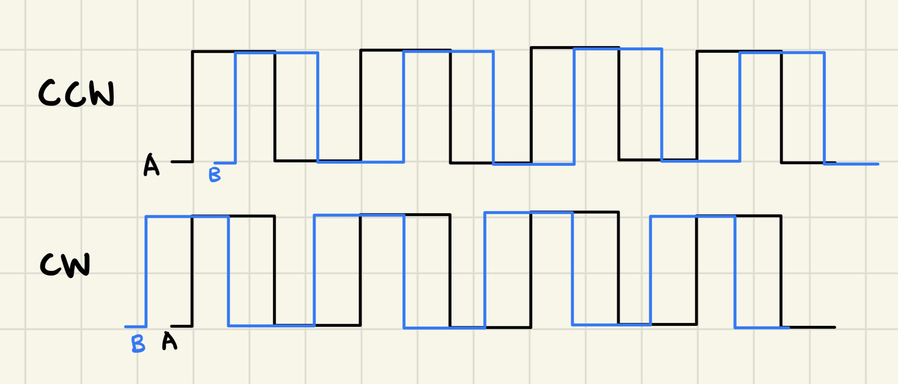
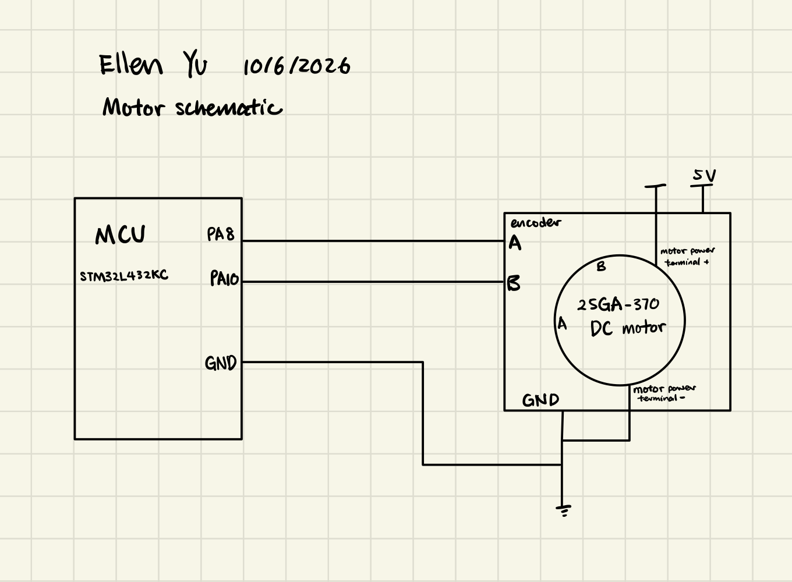
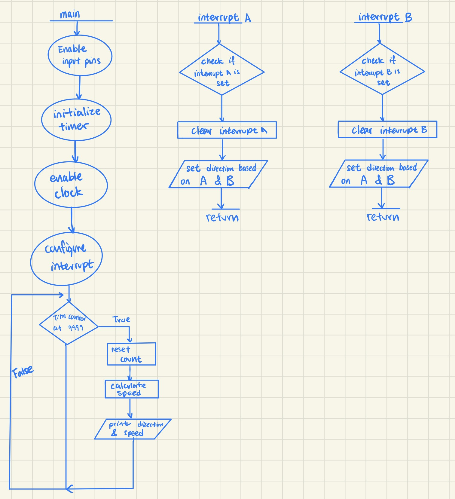

---
title: "Lab 5 - Interrupts"
description: "Using interrupt to display motor speed!"
author: "Ellen Yu"
date: "10/6/26"
categories:
  - reflection
  - labreport
draft: false
--- 
## Introduction
The design for this lab senses quadrature encoder pulses and convert those pulses into a motor velocity. It displays the motor speed in rps and the direction of velocity. 


::: {.callout-note collapse="true"}
## Demo video for the design

:::

## Design and Testing Methodology
This design uses the timer 2 to control the time gap between each display of velocity and direction. This design chooses to display the velocity every 1 second. The internal clock used is 80 MHz, with a prescalar value of 7999, one second passes when the counter value goes from 0 to 9999. Therefore, print logic is executed every time when the timer counter values gets to 9999. 

Interrupt is trigger whenever an edge is detected in either signal A or B and the interrupt handler increments the ```count```. Therefore, each pulse from the motor encoder causes the ```count``` variable to increment four times. Since ```count``` gets reset every 1 second and the datasheet states that the motor emits 408 pulses per revolution, the velocity of the motor can be calculated by:

$speed = count / (4 * 408)$

In terms of determining the direction of the motor, since the two signals A and B are 90 degrees out of phase, the direction the motor spins can be found by comparing whether ```A == B``` at the time of interrupt based on which signal's edge triggered the interrupt, as shown in @fig-wave. 

::: {.callout-note collapse="true"}
## Wave signal showing A and B when motor moves in different directions
{#fig-wave}
::: 

Having the interrupt to trigger at each edge of both signal A and B allows for a more precise measurement of velocity since the count value gets incremented at four evenly spaced times within one pulse time of the motor due to the fact that A and B are 90 degrees out of phase with each other. 

At high speeds, using polling may cause some of the pulses to be missed because of the fact that printing the outputs takes a relative long time. Interrupt would still be able to capture the pulses at high speed, with the cost of using more hardware. The internet suggests that the print statement takes around 5 microsecond. If the motor is spinning at 2 rev per second, there would be 816 pulses within one second. The timing between these pulses would be given by $1/816 = 1.2 ms$. This means that some of the pulses might be missed because the software is still printing. Interrupt would not have this issue and remain functional.


## Technical Documentation

The source code for the project can be found in the associated [Github repository](https://github.com/Teemooooooooo/e155-lab5).

### Schematic

The schematic in @fig-schematic shows the physical layout of the MCU to motor connection. The circuit design is based on the information found on the datasheet of the motor.

::: {.callout-note collapse="true"}
## Schematic of the Design
{#fig-schematic}
::: 
 
The schematic in @fig-flowchart shows the flow of code logic.

::: {.callout-note collapse="true"}
## Flowchart of the Design
{#fig-flowchart}
::: 


## Conclusion

The design successfully display the motor velocity and direction. 

I spent 10 hours on this lab.

## AI Prototype summary

I used ChatGPT to produce the code and it was able to build in segger. The LLM did not set up a clock because the prompt did not ask for the specifics of when the interface need to display values. I kept all my variables at 32 bits while the code produced by LLM has the variables at different bit length. 

