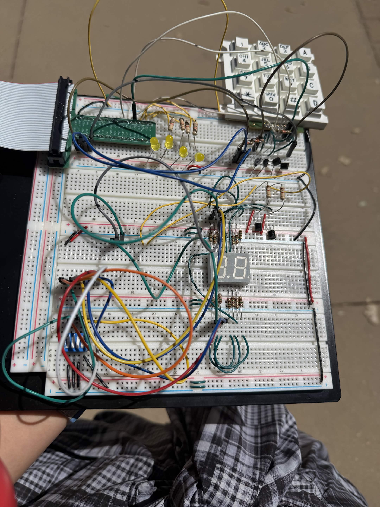
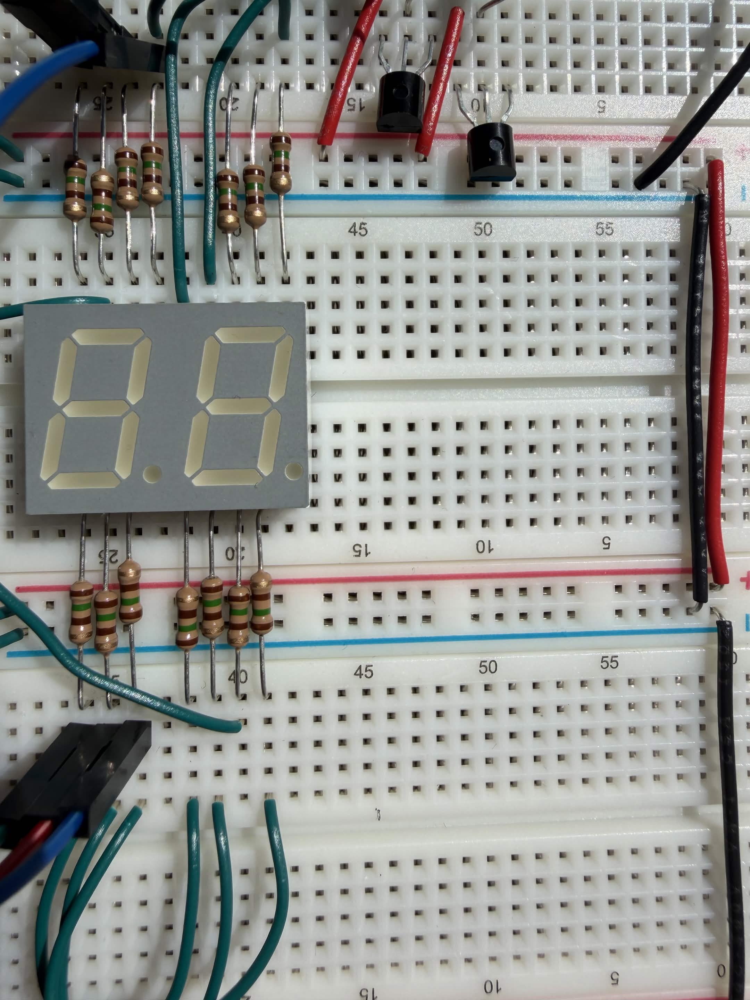

---
title: "Lab 2 - Done!"
description: "Remember to check power first when debugging..."
author: "Ellen Yu"
date: "9/17/26"
categories:
  - reflection
draft: false
--- 

I am writing this blog on the day after the check in. I spent around 20 hours on this lab, which is a big decrease from lab 1's 30 hours last week! 

One big problem that I faced in this lab is checking the functionality of my design when implemented onto hardware. I used the large breadboard for all of my hardware wiring without realizing that the upper half and lower half of the power and ground rails were not connected. I did most of my wiring on the lower half of the board without connecting it to the upper half of the board. This caused my hardware not working initially. 

{#fig-breadboard}

It was scary when the seven-segment display just not lights up at all (because it was not connected to power). The problem was successfully resolved by analyzing the circuit using multimeter.

I did not make much mistake in term of wiring. It works in terms of functionality, however, it looks very complicated with many overlapping wires over each other, as shown in @fig-breadboard. 

{#fig-nice_board}

When I first started breadboarding the design, it actually looked nice. I have everything cutted to the correct length and neatly laid out, as shown in figure @fig-nice_board. 

Now I need to continue building on this circuit for lab 3. Wish me good luck :D

Also I did get time to work on my art this week! 

{#fig-art}
