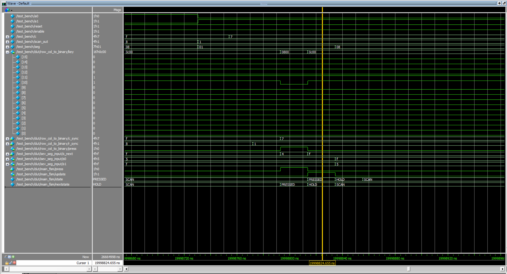
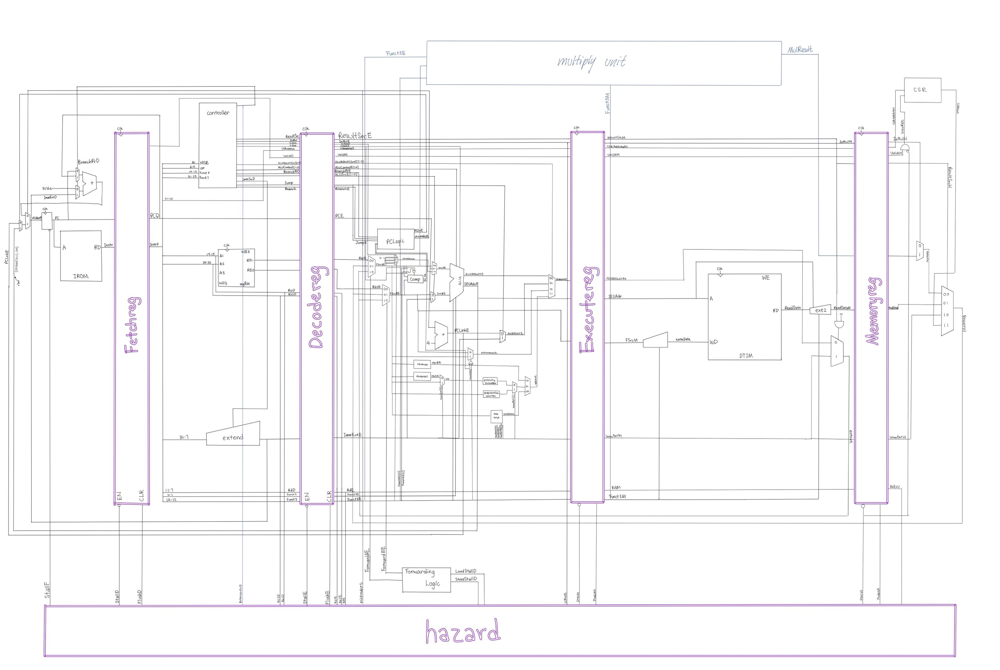

---
title: "Lab 3 - Close one but done!"
description: "Timing of signal is causing issues..."
author: "Ellen Yu"
date: "9/23/26"
categories:
  - reflection
draft: false
--- 

I just finished lab 3 check-in! I failed to defend my eight hours of sleep this week. I think the shortest sleep this week happened when I stayed up until 3:30 am in the digital lab and then woke up at 7:30 for the RISC-V Test Plan meeting. 

Anyways I want to talk about what I learned from this lab before I forget! The most significant issue that I ran into is the signals getting their value in mismatching clock ticks. 

For example, my first major issue was that my seven-segment display would always show 00 (which is the default display value) whenever two buttons are pressed at the same time. My first instinct was to reason it out: The display is only supposed to update when the update signal is high, and the update signal going high depends on other signals produced by the other modules. To isolate the problem, I started by checking each module individually. I did not use assert statements, but I added input signals to simulate some cases and used the waveform to confirm that the signals are behaving correctly. Each individual module are working as expected. This led me to think that the issue can be something with timing --- mismatching between what signal is set to high at which clock tick.

The final clue was found in @fig-timing_wave. By looking at the update signal, the s_next, s0 and s1 signals side by side, one can tell that the s_next state already changes to the new value when the main FSM sets the update signal. To address this issue, I introduced another flop to delay s_next by one clock cycle so that it matches with the control signals.

{#fig-timing_wave}

I had another major issue that I needed to debug: Every press that I exert gets registered multiple times. Again, I checked every module individually and verified their functionality, so the largest possible cause of failure is timing mismatch again. This time I do have a vague idea of where the issue might be: The fact that I am using ```r_sync``` as the enable signal into my flops that read column outputs from the keypad provides an easy way to fail: if data timing does not match the exact timing when the flop updates (for example, if the scanner moves on to the next row before the enable signal for the previous row turns off), the one key press can potentially be accidentally recorded as multiple key presses. This turned out to be the issue for me and it was fixed by adding a ```read``` signal connecting to the ```r_sync``` to ensure that the data only updates when somewhere in the middle of the the intended reading time.

For this lab, I started most of by debugging by flashing my code to hardware. Comparing to debugging using testbenches, hardware gives a physical intuition of how the design should function and where might have issue. It provides a good starting point for debugging. I then use test bench to trace down more specific signals. The challenge with starting with test bench is that the test bench is not necessarily correct and it would be even harder trying to debug two things at the same time :(.

By the way I produced pretty nice block diagram and it did not take very long this time! I think the block diagram I drew for system-on-chip actually left something in my brain.

The block diagram from SOC:

{#fig-soc_block}